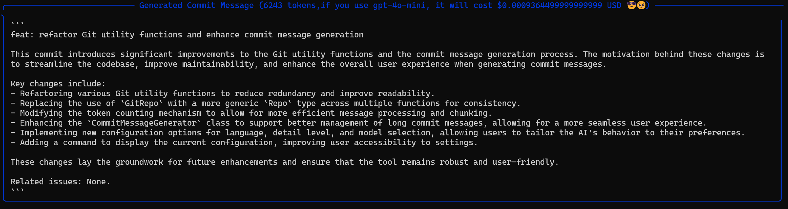

# Git-wise 🚀

[English](README.md) | [中文](README_zh.md)

Hey there! Welcome to Git-wise, your new AI-powered bestie for crafting awesome Git commit messages! 🎉

[](https://badge.fury.io/py/git-wise)
[](https://opensource.org/licenses/MIT)

## What's Git-Wise all about? 🤔

So, picture this: I'm working on another project, and suddenly I realize my commit game is... well, not exactly on point. 😅 Fast forward about 10 hours of coding frenzy, and boom! 💥 Git-Wise is born!

Git-Wise is like having a super smart friend who:
- 🧠 Uses GPT to analyze your staged files
- ✍️ Whips up commit messages that actually make sense
- 🚀 Submits them for you (because who has time for that, right?)

It's all about making your Git life easier and your commit history look pro! 😎

> Fun fact: Every single commit in this repo? Yep, Git-Wise helped craft it! 🫡

## Features that'll make you go "Wow!" 🌟

- 🤖 AI-powered magic (currently rocking with GPT-4O-mini)
- 🌍 Speaks multiple languages (because why not?)
- 🚀 Auto-commits like a boss
- 📏 Adjustable detail levels (for when you're feeling extra)

## Getting Started 🏁

## Installation

```bash
pip install git-wise
```
## Quick Start

1. Initialize git-wise:
```bash
git-wise init
```

2. Generate a commit message:
```bash
git add .
git-wise start
```

## Usage

### Basic Commands

```bash
# Initialize or reconfigure Git-Wise
git-wise init

# Generate commit message
git-wise start

# Generate commit message with specific options
git-wise start --language en --detail brief --interactive

# Check Git-Wise configuration and environment
git-wise doctor

# Show current configuration
git-wise show-config

# Show staged changes
git-wise show-diff

# Update specific configuration settings
git-wise config --default-language
git-wise config --detail-level
git-wise config --api-key
git-wise config --model
git-wise config --interactive
git-wise config --unlimited-chunk
```

### Configuration Options

- Language: Select your preferred language for commit messages
- Detail Level: Choose between brief, minimal, or detailed commit messages
- API Key: Set your OpenAI API key
- Model: Select the AI model to use
- Interactive Mode: Enable or disable interactive commit creation
- Unlimited Chunk: Enable or disable unlimited chunk mode(for large staged changes)

## Examples
### Detail Level

if you choose minimal:


if you choose brief:


if you choose detailed:



## Development

### Setup Development Environment

```bash
# Clone the repository
git clone https://github.com/creeponsky/git-wise.git
cd git-wise

# Create virtual environment
python -m venv venv
source venv/bin/activate  # or `venv\Scripts\activate` on Windows

# Install development dependencies
pip install -e "."
```

### Running Tests
find a git repo you need to test, and run the following command:
```bash
cd /path/to/your/git/repo
git-wise init
git-wise start
```

## Contributing

We welcome contributions! Please see our [Contributing Guide](CONTRIBUTING.md) for details.

1. Fork the repository
2. Create your feature branch (`git checkout -b feature/amazing-feature`)
3. Commit your changes (`git commit -m 'Add some amazing feature'`)
4. Push to the branch (`git push origin feature/amazing-feature`)
5. Open a Pull Request

## License

This project is licensed under the MIT License - see the [LICENSE](LICENSE) file for details.

## Acknowledgments

- OpenAI for providing the GPT API
- The Python community for excellent tools and libraries

## Support
- Visit our [website](https://git-wise.com) (currently under construction, but we'll add content soon! 😎)
- 📫 For bugs and feature requests, please [create an issue](https://github.com/creeponsky/git-wise/issues)
- 📧 For professional support, contact support@git-wise.dev

## Changelog

See [CHANGELOG.md](CHANGELOG.md) for all notable changes.