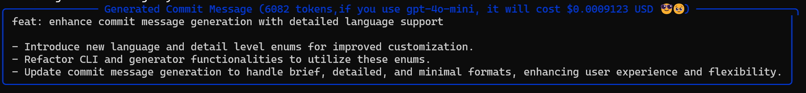
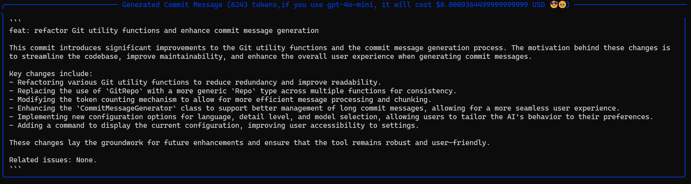

# Git-wise 🚀

[English](README.md) | [中文](README_zh.md)

嘿,欢迎来到 Git-wise,你的新 AI 助手,专门用于创作出色的 Git 提交消息! 🎉

[](https://badge.fury.io/py/git-wise)
[](https://opensource.org/licenses/MIT)

## Git-Wise 是什么? 🤔

想象一下:我正在另一个项目上工作,突然意识到我的提交信息...嗯,不是很理想。😅 经过大约 10 小时的疯狂编码,砰!💥 Git-Wise 诞生了!

Git-Wise 就像有一个超级聪明的朋友:
- 🧠 使用 GPT 分析你的暂存文件
- ✍️ 生成真正有意义的提交消息
- 🚀 为你提交(因为谁有时间做这个,对吧?)

这一切都是为了让你的 Git 生活更轻松,让你的提交历史看起来更专业! 😎

> 有趣的事实:这个仓库中的每一个提交?没错,都是 Git-Wise 帮忙创作的! 🫡

## 让你惊叹的功能 🌟

- 🤖 AI 驱动的魔法(目前使用 GPT-4O-mini)
- 🌍 支持多种语言(为什么不呢?)
- 🚀 自动提交,就是这么酷
- 📏 可调节的详细程度(当你想要更多细节时)

## 开始使用 🏁

### 安装

```bash
pip install git-wise
```
## Quick Start

1. 初始化
```bash
git-wise init
```

1. 生成commit
```bash
git add .
git-wise start
```

## 使用方法

### 基本命令

```bash
# 初始化或重新配置 Git-Wise
git-wise init

# 生成提交消息
git-wise start

# 使用特定选项生成提交消息
git-wise start --language zh --detail brief --interactive

# 检查 Git-Wise 配置和环境
git-wise doctor

# 显示当前配置
git-wise show-config

# 显示暂存的更改
git-wise show-diff

# 更新特定配置设置
git-wise config --default-language
git-wise config --detail-level
git-wise config --api-key
git-wise config --model
git-wise config --interactive
git-wise config --unlimited-chunk
```

### 配置选项

- 语言: 选择您偏好的提交消息语言
- 详细程度: 在简洁、最小化或详细的提交消息之间选择
- API 密钥: 设置您的 OpenAI API 密钥
- 模型: 选择要使用的 AI 模型
- 交互模式: 启用或禁用交互式提交创建
- 无限块模式: 启用或禁用无限块模式(用于大型暂存更改)

## 示例
### 详细程度

如果您选择最小化:


如果您选择简洁:


如果您选择详细:



## 开发

### 设置开发环境

```bash
# 克隆仓库
git clone https://github.com/creeponsky/git-wise.git
cd git-wise

# 创建虚拟环境
python -m venv venv
source venv/bin/activate  # 在 Windows 上使用 `venv\Scripts\activate`

# 安装开发依赖
pip install -e "."
```

### 运行测试
找到您需要测试的 git 仓库,然后运行以下命令:
```bash
cd /path/to/your/git/repo
git-wise init
git-wise start
```

## 贡献

我们欢迎贡献!请查看我们的[贡献指南](CONTRIBUTING.md)了解详情。

1. Fork 仓库
2. 创建您的功能分支 (`git checkout -b feature/amazing-feature`)
3. 提交您的更改 (`git commit -m '添加一些令人惊叹的功能'`)
4. 推送到分支 (`git push origin feature/amazing-feature`)
5. 打开一个拉取请求

## 许可证

本项目采用 MIT 许可证 - 详情请参阅 [LICENSE](LICENSE) 文件。

## 致谢

- 感谢 OpenAI 提供 GPT API
- 感谢 Python 社区提供优秀的工具和库

## 支持
- 访问我们的[网站](https://git-wise.com) (目前正在建设中,但我们很快会添加内容! 😎)
- 📫 对于错误和功能请求,请[创建一个 issue](https://github.com/creeponsky/git-wise/issues)
- 📧 如需专业支持,请联系 support@git-wise.dev

## 更新日志

查看 [CHANGELOG.md](CHANGELOG.md) 了解所有重要变更。
